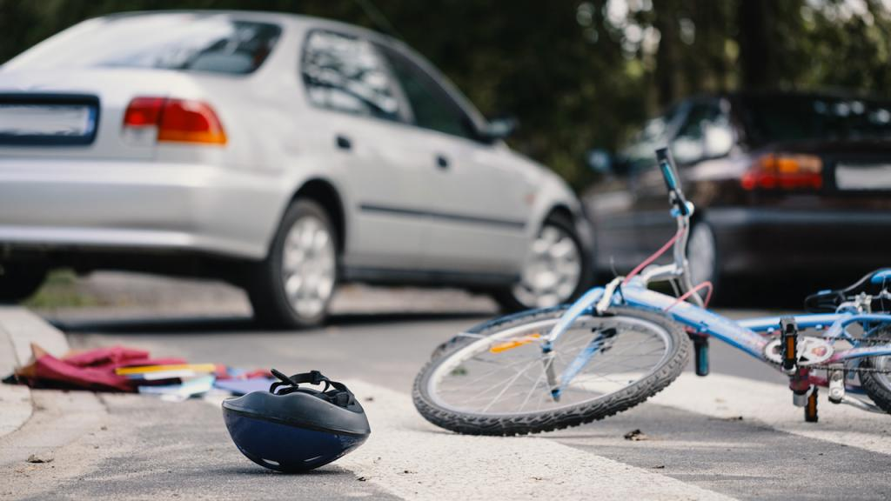
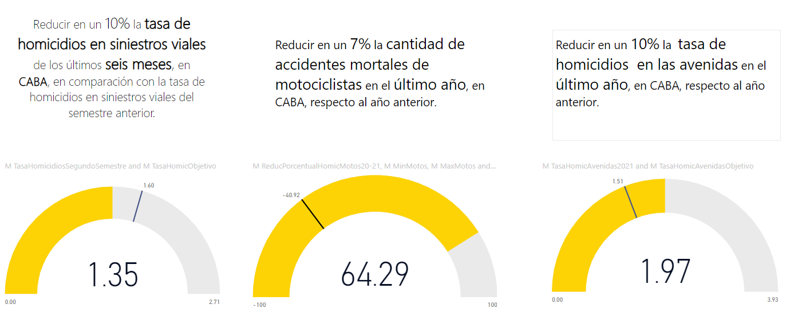

<h1 align='center'>
 <b>Homicidios por siniestros viales en la Ciudad Autónoma de Buenos Aires</b>
</h1>

## <h1 align="center">**Introduccion**</h1>

En este escenario simulado, asumimos el papel de un Analista de Datos en el equipo de una empresa consultora. La empresa ha sido contactada por el Observatorio de Movilidad y Seguridad Vial (OMSV), un centro de estudios bajo la jurisdicción de la Secretaría de Transporte del Gobierno de la Ciudad Autónoma de Buenos Aires (CABA). El OMSV ha solicitado a nuestro equipo la realización de un proyecto de análisis de datos.

El objetivo primordial de este proyecto es proporcionar información valiosa que permita a las autoridades locales tomar medidas concretas para reducir el número de víctimas mortales en accidentes de tránsito ocurridos en CABA. Para llevar a cabo este análisis, contamos con un conjunto de datos que abarca los homicidios en siniestros viales ocurridos en la Ciudad de Buenos Aires durante el período comprendido entre 2016 y 2021.

Como productos finales, se espera la entrega de un informe detallado que describa las tareas realizadas, las metodologías adoptadas y las conclusiones principales. Además, se solicita la creación de un panel de visualización interactivo (dashboard) que facilite la interpretación de la información y su análisis.

## <h1 align="center">**Contexto**</h1>

Los siniestros viales, también denominados accidentes de tráfico o accidentes de tránsito, constituyen eventos que involucran vehículos en las vías públicas y pueden originarse por diversas causas, como colisiones entre automóviles, motocicletas, bicicletas o peatones, atropellos, choques con objetos fijos o caídas de vehículos. Estos incidentes pueden acarrear consecuencias que van desde daños materiales hasta lesiones graves o incluso fatales para los involucrados.

La Ciudad Autónoma de Buenos Aires (CABA), situada en la provincia de Buenos Aires, Argentina, no escapa a esta problemática. Los siniestros viales representan una preocupación significativa debido al elevado volumen de tráfico y la densidad poblacional en la zona. Estos eventos pueden afectar de manera considerable la seguridad de los residentes y visitantes de la ciudad, así como la infraestructura vial y los servicios de emergencia.

Según el censo poblacional realizado en 2022, la población de CABA se estima en 3,120,612 habitantes, ocupando una superficie de 200 km^2, lo que implica una densidad aproximada de 15,603 hab/km^2. Además, en julio de 2023, se registraron 12,437,735 vehículos transitando por los peajes de las autopistas de acceso a CABA. En este contexto, la prevención de siniestros viales y la implementación de políticas efectivas son fundamentales para abordar de manera adecuada esta problemática.

## <h1 align="center">**Datos**</h1>

Para este proyecto se trabajó con la **Bases de Víctimas Fatales en Siniestros Viales** que se encuentra en formato de Excel y contiene dos pestañas de datos:

* **HECHOS**: que contiene una fila de hecho con id único y las variables temporales, espaciales y participantes asociadas al mismo.
* **VICTIMAS**: contiene una fila por cada víctima de los hechos y las variables edad, sexo y modo de desplazamiento asociadas a cada víctima. Se vincula a los HECHOS mediante el id del hecho.

En este [documento](Data\NOTAS_HOMICIDIOS_SINIESTRO_VIAL.pdf) se detallan todas las definiciones manejadas en los datos y en el desarrollo de este proyecto. Por otra parte, en este [link](https://data.buenosaires.gob.ar/dataset/victimas-siniestros-viales) se encuentran los datos utilizados en el análisis.

## <h1 align="center">**Tecnologias**</h1>

Para la elaboración de este proyecto se utilizó Python y Pandas para los procesos de extracción, transformación y carga de los datos, como así también para el análisis exploratorio de los datos. En el siguiente apartado se describen los resultados del análisis.

Luego, para la obtención complementaria de datos para el cálculo de la población en el año 2021 se realizó webscraping utilizando la librería BeautifulSoup. Todos los detalles se explican [aquí](Poblacion_CABA.ipynb).

Finalmente, para la construcción de un dashboard interactivo se utiliza Power BI, el cuál se puede consultar [aquí](DashBoard.pbix). 

## <h1 align="center">**EDA**</h1>

En primer lugar, se realizó la extracción de los datos. Luego de llevar a cabo un breve análisis exploratorio y descriptivo de estos, abordaremos temas como outliers, valores duplicados y valores faltantes. Además, nos ocuparemos de normalizar ciertas columnas para poder trabajar con ellas de manera óptima en la realización de gráficos pertinentes con sus respectivas variables. Se decidió dividir esta EDA en dos partes para una mayor practicidad y facilidad de lectura y organización. Esta primera  [EDA_PARTE_1](EDA_Parte_1.ipynb)abarcará lo mencionado anteriormente, y posteriormente, en el segundo documento [EDA_PARTE_2](EDA_Parte_2.ipynb), se llevarán a cabo los gráficos pertinentes.

# <h1 align="center">**Analisis de los datos**</h1>
## <h1 align="center">**Análisis de la Distribución Temporal**</h1>

En una primera evaluación, se examinó la variable temporal para comprender la distribución de los homicidios en distintas escalas temporales. La distribución anual de víctimas fatales es notablemente del 60% durante los primeros 3 años del conjunto de datos, con una disminución marcada en 2020 debido a las medidas de cuarentena por la pandemia de COVID-19. La variación mensual a lo largo del año es significativa, con un pico en diciembre. Este aumento en diciembre se relaciona con la flexibilización de las medidas de cuarentena.

Descendiendo en la escala temporal, se observa que el 70% de las víctimas perdieron la vida entre lunes y viernes, sugiriendo una posible asociación con los desplazamientos diarios al trabajo. Sin embargo, en la distribución semanal, no se aprecian diferencias significativas entre los diversos días. Es decir, la cantidad de víctimas en sábado o domingo es aproximadamente la misma para el conjunto de datos.

Al analizar las franjas horarias, se destaca que el 12% de las víctimas se registraron entre las 6 a 8 de la mañana, lo que sugiere una posible relación con el horario de ingreso al trabajo. No obstante, dentro de esta franja horaria, el 55% de las víctimas experimentaron los incidentes durante el fin de semana.

## <h1 align="center">**Perfil de la Víctima**</h1>

En cuanto al perfil de la víctima, se observa que el 77% de las víctimas son de género masculino. Casi el 50% de las víctimas se sitúan en el rango de edad de 25 a 44 años, y dentro de este grupo, el 84% son hombres.

En relación al rol de la víctima, es decir, la posición que ocupaba al momento del incidente, el 48% eran conductores. Este 48% se divide en un 77% de víctimas que se movilizaban en moto y un 19% en auto. En cuanto al medio de transporte al momento del hecho, el 42% son conductores de moto, siendo el 88% de estos conductores de género masculino.

En cuanto a la responsabilidad en el incidente, es decir, el vehículo que ocupaba la persona acusada, en el 29% de los casos fue un auto, pero el 75% son responsabilidad de vehículos como autos, colectivos y camiones.

## <h1 align="center">**Analisis por ubicacion**</h1>

se exploraron patrones en la distribución espacial de los hechos. Un hallazgo destacado es que en todas las comunas de CABA, las avenidas, vías arteriales de al menos 13 metros de ancho, son comunes en los accidentes. El 62% de las víctimas perdieron la vida en avenidas, y el 82% de estos incidentes ocurrieron en el cruce de avenidas con otras calles. Este patrón se mantiene consistente a lo largo de los años. En relación al rol de la víctima, varía entre moto y peatón en distintas comunas.

# <h1 align="center">**KPIs**</h1>

- `*Reducir en un 10% la tasa de homicidios en siniestros viales de los últimos seis meses, en CABA, en comparación con la tasa de homicidios en siniestros viales del semestre anterior*`.
  
  Definimos a la **tasa de homicidios en siniestros viales** como el número de víctimas fatales en accidentes de tránsito por cada 100,000 habitantes en un área geográfica durante un período de tiempo específico.
  Su fórmula es: 
      
  $\text{Tasa de homicidios en siniestros viales} = \frac{\text{Número de homicidios en siniestros viales}}{\text{Población total}}·100,000$

  Para determinar la Población Total en el año 2021, se realizó una estimación basada en los censos poblacionales de 2010 y 2022. Este valor se utiliza en el cálculo de la Tasa de Homicidios en Siniestros Viales.

  En el año 2021, la tasa de homicidios en siniestros viales fue de 1.77, lo que indica que hubo aproximadamente 1.77 homicidios en accidentes de tránsito por cada 100,000 habitantes durante los primeros 6 meses del año. El objetivo establecido es reducir esta tasa al 1.60 en el siguiente semestre de 2021, representando una disminución del 10%.

  Al calcular el KPI para este período, se encuentra que la Tasa de Homicidios en Siniestros Viales fue de 1.35, lo que significa que se cumplió con éxito el objetivo propuesto. Este resultado sugiere una mejora en la seguridad vial durante el segundo semestre de 2021, logrando una reducción del 10% en comparación con el semestre anterior.

- `*Reducir en un 7% la cantidad de accidentes mortales de motociclistas en el último año, en CABA, respecto al año anterior*`.
  
  Definimos a la **cantidad de accidentes mortales de motociclistas en siniestros viales** como el número absoluto de accidentes fatales en los que estuvieron involucradas víctimas que viajaban en moto en un determinado periodo temporal.
  Su fórmula para medir la evolución de los accidentes mortales con víctimas en moto es:
    
    $\text{Cantidad de accidentes mortales de motociclistas} = -\frac{\text{Víctimas moto año anterior - Víctimas moto año actual}}{\text{Víctimas moto año anterior}}·100$

    Donde:
    - $\text{Víctimas moto año anterior}$: Número de accidentes mortales con víctimas en moto en el año anterior
    - $\text{Víctimas moto año actual}$: Número de accidentes mortales con víctimas en moto en el año actual 

  Para analizar la evolución de los accidentes mortales de motociclistas, se compararon las cifras entre el año 2020 (considerado como el año anterior) y el año 2021 (considerado como el año actual). El objetivo establecido era lograr una reducción del 7% en la cantidad de accidentes mortales en comparación con el año anterior.

  Inicialmente, se calculó la Cantidad de Accidentes Mortales de Motociclistas para el año 2020, obteniendo un valor de -44.00. Este resultado negativo indica una disminución con respecto al año anterior y establece la base para el objetivo a alcanzar. El objetivo propuesto fue una reducción del 7%, equivalente a -40.92 accidentes.

  Sin embargo, al calcular la Cantidad de Accidentes Mortales de Motociclistas para el año 2021, se obtuvo un valor de 64.29, lo que indica un aumento del 64% en la cantidad de muertes de conductores de motocicletas en comparación con el año 2020. Este resultado sugiere que, lamentablemente, no se logró cumplir con el objetivo establecido, ya que se experimentó un incremento significativo en la cantidad de accidentes mortales de motociclistas durante el año 2021.

* `*Reducir en un 10% la tasa de homicidios en las avenidas en el último año, en CABA, respecto al año anterior*`

    Como se vio en el análisis exploratorio, el 62% de las víctimas mortales transitaban por avenidas al momento del hecho. Se define a la **Tasa de homicidios en las avenidas** al número de víctimas fatales en accidentes de tránsito en avenidas por cada 100,000 habitantes en un área geográfica durante un período de tiempo específico, en este caso anual. Su fórmula es:

    $\text{Tasa de homicidios en las avenidas} = \frac{\text{Número de accidentes mortales con víctimas ocurridas en avenidas}}{\text{Total de la población}}·100000$

    
    Para analizar la seguridad en las avenidas, se calculó la Tasa de Homicidios en Avenidas para el año 2020, obteniendo un valor de 1.68. Este indicador sirvió como referencia para establecer un objetivo ambicioso para el año siguiente, fijando una reducción del 10% en la tasa de homicidios en comparación con el año 2020. El objetivo definido fue alcanzar una Tasa de Homicidios en Avenidas de 1.51 para el año 2021.

    Sin embargo, al calcular la Tasa de Homicidios en Avenidas para el año 2021, se obtuvo un valor de 1.97, indicando que no se logró cumplir con el objetivo establecido. En lugar de experimentar una disminución del 10%, la tasa de homicidios en avenidas aumentó en comparación con el año anterior, superando las expectativas planteadas. Este resultado sugiere la necesidad de revisar y ajustar estrategias para mejorar la seguridad vial en las avenidas de la Ciudad Autónoma de Buenos Aires

## <h1 align="center">**Conclusiones**</h1>

Durante el periodo de 2016 a 2021, se registraron 717 víctimas fatales en accidentes de tránsito en la Ciudad Autónoma de Buenos Aires (CABA). De este total, el 70% de los incidentes tuvieron lugar durante los días de la semana, resaltando la importancia de focalizar las medidas de seguridad en estos momentos específicos.

### Hallazgos Clave:

- **Franja Horaria:** El 12% de los siniestros fatales ocurre entre las 6 y las 8 de la mañana, principalmente durante los fines de semana.
  
- **Mes Crítico:** Diciembre registra el máximo de fallecimientos, destacando la importancia de campañas específicas durante este mes.

- **Género y Edad:** El 77% de las víctimas fueron hombres, la mitad de ellos en el rango de 25 a 44 años.

- **Tipo de Usuario:** Motociclistas representan el 42% de los casos.

- **Avenidas:** El 62% de los homicidios viales ocurrieron en avenidas, con el 82% en cruces con otras calles.

### Recomendaciones:

1. Continuar monitoreando los objetivos propuestos con campañas específicas, especialmente dirigidas a conductores de motos y usuarios de avenidas.

2. Reforzar las campañas de seguridad vial entre los días viernes a lunes, intensificando particularmente en el mes de Diciembre.

3. Puntualizar campañas de conducción segura en avenidas y cruces de calles.

4. Dirigir las campañas de seguridad hacia el sexo masculino, especialmente en cuanto a conducción en moto, para un rango etario entre los 15 a 44 años.

### Resultados y Metas Cumplidas:

A pesar de haber alcanzado con éxito el objetivo de reducir la tasa de homicidios en siniestros viales durante el segundo semestre de 2021, no se lograron cumplir las metas establecidas para disminuir la cantidad de accidentes mortales en motociclistas ni en avenidas durante ese mismo año en comparación con 2020.

En consecuencia, se recomienda continuar monitoreando y ajustando estrategias, con un enfoque específico en campañas dirigidas a conductores de motos, usuarios de avenidas y días específicos de la semana, especialmente en el mes de Diciembre. Además, se sugiere reforzar las campañas destinadas al sexo masculino, abarcando la conducción segura, especialmente para aquellos en el rango etario entre 15 y 44 años. Estas acciones podrían contribuir significativamente a mejorar la seguridad vial en CABA.

